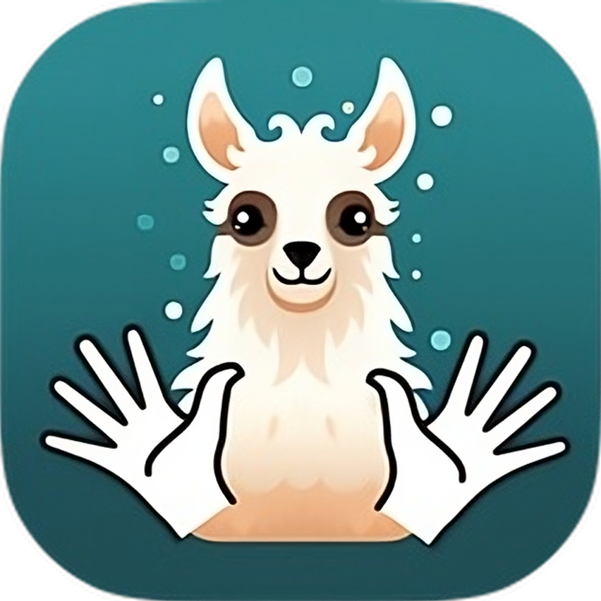

# SignLLaVA Demo

This repository contains the demonstraion web application for the SignLLaVA model developed as part of the [10th Frederick Jelinek Memorial Summer Workshop on Speech and Language Technology](https://www.clsp.jhu.edu/2024-jelinek-summer-workshop-on-speech-and-language-technology/).

For a quick introduction, see the 15-minute final presentation section showing the demo: https://www.youtube.com/live/65L7tklQbyc?t=10323s

## Purpose

The application has these goals:

1. Provide a visual interface for running the model.
    - to allow for easy model presentation to a general audience
    - to quickly qualitatively test newly trained checkpoints of the model
2. Expose and visualize data flowing between internal model components.
    - to help researchers debug model performance issues
    - to better understand the behaviour of constituent parts of the model

## Architecture overview

The application consists of two parts:

1. Python backend application responsible for:
    - Running the SignLLaVA model and its constituent parts (MediaPipe, MAE, DINOv2, Sign2Vec).
    - Storing the uploaded videos and all processed data about them.
    - Allowing for upload of videos and download of the processed data via an HTTP API.
2. Frontend single-page web application:
    - To provide visual user interface for the application.

## How to install

> **Note:** For a more concrete tutorial on how to do installation, read [Installing on rockfish and your laptop](docs/installing-on-rockfish-and-your-laptop.md).

> **Note:** To run the backend part, you only need `Python 3.10` or newer on the machine. To run the frontend hosting server, you only need `Node.js`. The frontend can then be accessed and rendered by any modern web browser, though the testing and development has been done on Chromium and Firefox.

The two parts of the application (frontend and backend) are designed to run independently, possibly on different machines. The way in which you set up your deployment depends on your situation.

For example:
- If you have a machine with a GPU, you can run both components on your machine locally.
- If you only a have a thin laptop and have access to a compute cluster, you can run the backend on the cluster and the frontend on your laptop and connect the two via an SSH port-forwarding tunnel (see the linked tutorial at the beginning).
- Finally, if you want to make the application publicly available, you get a server machine with a GPU, install both parts on it, and expose the frontend and backend parts to the internet (though both parts need to be configured properly to communicate with each other).

Start by installing the backend. The installation instructions are present in the [Backend README file](backend/README.md). Once finished, you should be able to access the backend HTTP API through your web browser at the appropriate address (for example `http://localhost:1817`).

> **Note:** The port `1817` was chosen for the backend service, because it's the year, when the [first school for the deaf was established in the US](https://en.wikipedia.org/wiki/Schools_for_the_deaf).

Second, install the frontend, for which the instructions are again present in [the frontend README](frontend/README.md). If the installation goes well, you should again be able to access the frontend from your web browser (for example at `http://localhost:1234`).

The frontend communicates with the backend through your browser only. If you see a `Failed to fetch` error on the frontend page, there are some issues accessing the backend. Check that you can access the backend yourself directly and that the frontend is accessing the proper backend address and port (possibly fix that in the frontend config).

## Documentation pages

- [Installing on Rockfish and your laptop](docs/installing-on-rockfish-and-your-laptop.md)
- [How to develop](docs/how-to-develop.md)
- [Architecture](docs/architecture.md)
- [Dataflow](docs/dataflow.md)
- [Hardware requirements](docs/hardware-requirements.md)
- [Testing custom SignLLaVA checkpoint](docs/testing-custom-signllava-checkpoint.md)
